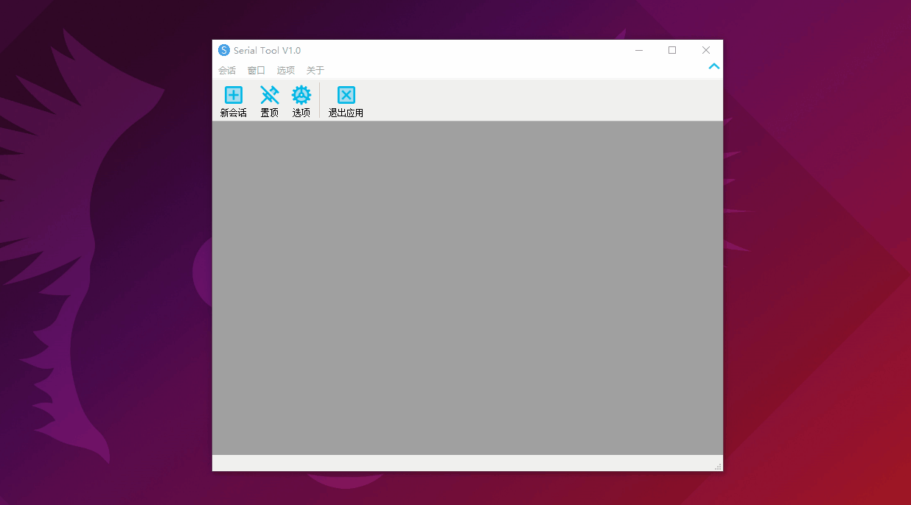
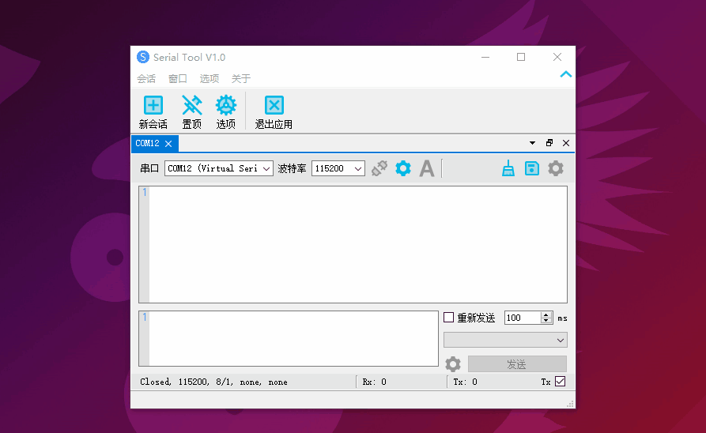
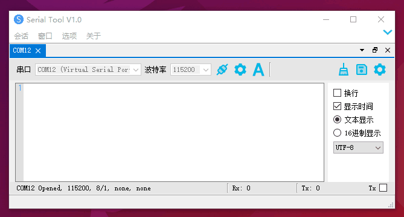

# serial tool

Qt 开发的一个简单的串口工具。

## 特性

1. 会话形式，可以多会话窗口，可记住上一次运行的会话及其设置状态，会话可导出及恢复。

   

2. 系统托盘保持后台运行。

   

3. 串口会话窗口可以根据需要极简，隐藏不需要的设置，以及隐藏发送区域。

   

4. 接收区域多种显示形式设置

   1. hex
   2. hex + time
   3. text
   4. text + time
   5. 目前添加了 UTF-8 和 GB18030 的编码解析

   

5. 串口设备可自动连接

## 编译运行

1. 参考文档 [QScintilla 编译](libs/README.md) 对 QScintilla 进行编译(Qt5.15.2)。
2. 其他的依赖库：[ads](https://github.com/githubuser0xFFFF/Qt-Advanced-Docking-System)，[SingleApplication](https://github.com/itay-grudev/SingleApplication) 已经编译好放在了仓库中。
3. 用 Qt Creator 打开 serial-tool/serial-tool.pro 工程即可进行开发调试。

